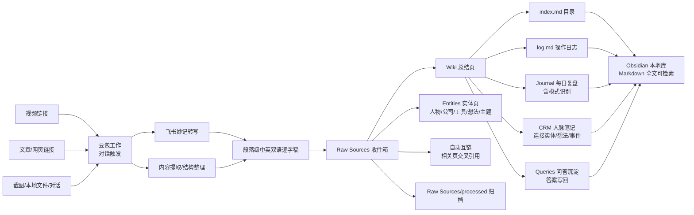

# Obsidian Doubao Second Brain（豆包第二大脑）

> **EN TL;DR**: A Doubao Work (豆包工作) Skill that turns **Obsidian** into a self-updating second brain — **three pillars** (Wiki / Journal / CRM) + **entity layer** (auto-extracted people/companies/tools/ideas/themes) + **query recycling** (answers written back) + raw/processed archiving + auto-linking + pattern detection + auto-backup. Feed in videos / articles / screenshots / links, transcribe with Feishu Minutes (飞书妙记), produce bilingual (EN/中文) notes. The Chinese, no-code counterpart of Matt Wolfe's *Obsidian + Codex* setup — **all features aligned**.

用 **豆包工作 + Obsidian** 搭建的「第二大脑」开源 Skill——对标 Matt Wolfe《Build A Second Brain That Remembers Everything》（Obsidian + Codex）方案的中文零代码版，**12 项能力全对齐**。

- 🧠 **三支柱**：**Wiki**（知识库）+ **Journal**（每日复盘，含模式识别）+ **CRM**（人脉笔记，连接万物）
- 🏷 **实体层**：自动提取人物/公司/工具/想法/主题 → 实体页累积「提及记录」（点工具页能看到所有提到它的来源）
- 🔗 **自动互链**：摄入时自动检索现有库互相链接，Zettelkasten 式知识网络
- 🗂 **raw/processed 归档**：处理完的文件自动归档，收件箱保持干净
- 💬 **问答沉淀**：向库提问的答案写回 `Wiki/Queries/`，每次提问都在复利
- 📈 **模式识别**：复盘自动扫描近 30 天历史，识别反复出现的主题/挣扎
- 💾 **自动备份**：每日 git commit（可配置私有 GitHub 远程自动 push）
- 🎙 **飞书妙记转写**：视频自动转逐字稿（B站试看受限时自动溯源 YouTube 原版）
- 🌐 **中英双语**：逐字稿段落级 EN 原文 + 中文意译
- 🤝 **人在环中**：哪些入库、怎么翻译，由你决定——不是全自动的黑盒

---

## 架构（Architecture）



## 与 Matt Wolfe 方案 12 项逐条对齐

| # | Matt Wolfe 核心能力 | 本 Skill 实现 |
|---|---|---|
| 1 | 三支柱（Wiki + Journal + CRM） | ✅ 齐备 |
| 2 | LLM-Wiki 架构（raw → wiki → index/log） | ✅ Raw Sources → Wiki → index/log |
| 3 | 每小时自动化 | ✅ 豆包工作定时任务（每日巡检+复盘+备份） |
| 4 | agents.md 单一控制文件 | ✅ AGENTS.md 一份规则驱动全部 |
| 5 | Web Clipper 收集 | ✅ 等价：链接/截图/文件/对话直喂豆包 |
| 6 | 私有备份 + 复合增长 | ✅ 每日 git commit + 私有 GitHub 远程 |
| 7 | 实体页层（人物/公司/工具/想法/主题） | ✅ Wiki/Entities/ 自动提取累积 |
| 8 | 自动互链（auto-link + back-link） | ✅ 摄入时检索现有库互链 |
| 9 | raw/processed 归档 | ✅ Raw Sources/processed/ |
| 10 | 问答写回（答案变可复用页） | ✅ Wiki/Queries/ |
| 11 | Journal 模式识别（历史日记找模式） | ✅ 近 30 天扫描，≥3 次标注 |
| 12 | CRM 连接万物（人 ↔ 想法/公司/事件） | ✅ linked_entities 互链 |

---

## 快速开始（Quick Start）

### 前置条件
1. 安装 [Obsidian](https://obsidian.md/)，新建一个库（vault）
2. 豆包工作（本地客户端 / 云电脑 / 网页端均可用）

### 安装 Skill
1. 下载本仓库
2. 把仓库根目录作为豆包工作 Skill 安装（或将 `SKILL.md` 所在目录加入豆包工作技能根目录）
3. 用仓库内 `scripts/init_vault.py` 初始化知识库骨架：

```bash
python3 scripts/init_vault.py --vault "/你的/Obsidian/库路径"
```

会生成全能力骨架：`Raw Sources/`（含 `processed/` 归档区）、`Wiki/`（含 `Entities/` + `Queries/`）、`Journal/`、`CRM/`、`AGENTS.md`、`SCHEMA.md`、`index.md`、`log.md`、`欢迎.md`。

### 依赖与说明（Dependencies）

| 能力 | 用途 | 获取方式 |
|---|---|---|
| 豆包工作 | 对话式 AI 入口（Skill 运行宿主） | [豆包工作官网](https://www.doubao.com/) 安装桌面端 |
| 飞书妙记 | 视频 → 逐字稿转写 | 豆包工作内授权飞书账号，首次视频转写会自动触发授权 |
| doubao-video-extract | 视频下载/转音频/妙记链路 | 豆包工作内置视频提取能力；若你的环境没有，可跳过视频类输入（文章/截图/文件仍可用） |

> **给首次使用者的提示**：本 Skill 的核心是"对话驱动"——你不需要配置 API Key。视频转写能力依赖飞书妙记授权；若只想先跑通文本/截图/链接入库，无需任何额外授权。

### 喂第一份内容
打开豆包工作，直接说：

> 把这个链接/截图/文件的内容整理进我的 Obsidian 知识库，做成中英双语

豆包会走完整链路：提取 →（视频则转写）→ 双语 → 写 Raw Sources → 生成 Wiki 总结页 + 实体页 → 自动互链 → 归档 processed/ → 更新 index/log。

> Obsidian 外接卷新文件需 `Cmd+P → Reload app` 刷新。

### 用全部能力

> 「今天复盘一下」→ `Journal/<日期>-复盘.md`（含模式识别）
>
> 「记录一下 XX，XX 公司的」→ `CRM/<姓名>.md`（自动关联实体）
>
> 「我的知识库对 XX 怎么看？」→ 回答 + 自动沉淀到 `Wiki/Queries/`
>
> 配置豆包定时任务 → 每日巡检 + 复盘 + git 备份全自动

---

## 知识库规范（Vault Convention）

```
你的库/
├── Raw Sources/          # 原始摄入收件箱（逐字稿、原文存档）
│   └── processed/        # 已处理归档区（处理完自动移入）
├── Wiki/                 # AI 维护的总结/概念页（知识支柱）
│   ├── Entities/         # 实体页：人物/公司/工具/想法/主题（自动累积）
│   └── Queries/          # 问答沉淀页（答案写回）
├── Journal/              # 每日复盘（含模式识别）
├── CRM/                  # 人脉笔记（连接实体/想法/事件）
├── AGENTS.md             # 规则层（一份文件驱动全部能力）
├── SCHEMA.md             # 页面结构 Schema
├── index.md              # 全库目录（AI 提问前先读这里）
├── log.md                # 操作日志（最新在上）
└── 欢迎.md               # 入库起点
```

- 所有页面互相用 Obsidian 双括号 `[[链接]]` 关联（Wiki ↔ Entities ↔ Journal ↔ CRM ↔ Queries）
- 每次摄入/更新都写 `log.md`，同步 `index.md` 页面总数

---

## 效果示例（Preview）

`scripts/init_vault.py --demo` 初始化后的库结构：

```text
你的库/
├── Raw Sources/01-使用说明.md
│   └── processed/README.md              # 归档区说明
├── Wiki/_template.md                    # 总结页模板
│   ├── Entities/_template.md            # 实体页模板（提及记录累积）
│   └── Queries/_template.md             # 问答沉淀模板
├── Journal/_template.md                 # 每日复盘模板（含模式识别）
├── CRM/_template.md                     # 人脉笔记模板（linked_entities）
├── AGENTS.md / SCHEMA.md / index.md / log.md / 欢迎.md
```

一次真实视频摄入后的产物（真实案例）：

```text
Raw Sources/processed/2026-10-01-obsidian专家系统-zettelkasten.md   # 归档后的双语逐字稿
Wiki/Obsidian-Zettelkasten成为专家系统.md                            # 总结页
Wiki/Entities/实体-想法-Zettelkasten.md                             # 实体页（提及记录）
Wiki/Queries/2026-10-01-什么是Zettelkasten.md                        # 问答沉淀
Journal/2026-10-01-复盘.md                                           # 当日复盘引用
index.md  → 页面总数增长，新增摘要行
log.md    → 追加：来源/链路/创建文件
```

Obsidian 图视图中：Raw Sources → Wiki → Entities → Journal/CRM/Queries，双括号 `[[链接]]` 形成越来越密的知识网络。

---

## 文档（Docs）

- [docs/ARCHITECTURE.md](docs/ARCHITECTURE.md) — 架构与对标分析（全能力）
- [docs/SOP.md](docs/SOP.md) — 视频/文章/截图/复盘/CRM/问答/巡检的标准操作流程
- [docs/COMPARISON.md](docs/COMPARISON.md) — 与 Matt Wolfe 方案 12 项逐条对比

## 示例模板（Examples）

- [examples/vault-template](examples/vault-template/) — 可直接复制进 Obsidian 的知识库骨架模板（AGENTS / SCHEMA / index / log / Wiki / Entities / Queries / Journal / CRM）

---

## 隐私（Privacy）

- 你的笔记永远留在本机 Obsidian 库，Markdown 明文
- 豆包工作只在处理时读取你喂的内容，不采集库内历史笔记
- 视频转写经飞书妙记（需豆包工作授权），转写结果回落本地库
- **备份建议**：库目录每日 git commit；配置私有 GitHub remote 后自动 push——私有仓库不公开你的笔记

## 许可（License）

[MIT](LICENSE)

---

## 致谢（Credits）

- Andrej Karpathy — [LLM Wiki](https://gist.github.com/karpathy/00103b0037c5a36c4870588b1a0c0d8d) 概念
- Matt Wolfe — Obsidian + Codex 第二大脑方案（本项目的英文对标：12 项能力全对齐）
- 飞书妙记 — 视频转写能力
