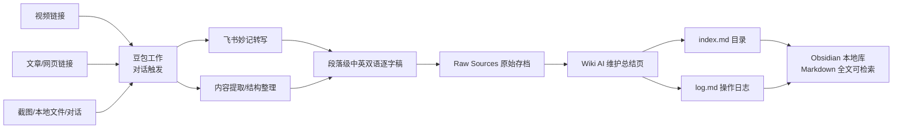

# Obsidian Doubao Second Brain（豆包第二大脑）

> **EN TL;DR**: A Doubao Work (豆包工作) Skill that turns **Obsidian** into a self-updating second brain — feeding in videos / articles / screenshots / links, transcribing with Feishu Minutes (飞书妙记), and producing bilingual (EN/中文) markdown notes into a Raw Sources → Wiki vault. The Chinese, no-code counterpart of Matt Wolfe's *Obsidian + Codex* setup.

用 **豆包工作 + Obsidian** 搭建的「第二大脑」开源 Skill——对标 Matt Wolfe《Build A Second Brain That Remembers Everything》（Obsidian + Codex）方案的中文零代码版。

- 🧠 **喂什么都能消化**：视频链接（B站/YouTube）、文章链接、截图、本地文件、对话内容
- 🎙 **飞书妙记转写**：视频自动转逐字稿（B站试看受限时自动溯源 YouTube 原版）
- 🌐 **中英双语**：逐字稿段落级 EN 原文 + 中文意译
- 📚 **Karpathy LLM-Wiki 三层架构**：`Raw Sources`（原始摄入）→ `Wiki`（AI 维护总结）→ `index.md`（目录）+ `log.md`（操作日志）
- 🤝 **人在环中**：哪些入库、怎么翻译，由你决定——不是全自动的黑盒

---

## 架构（Architecture）



对比 Matt Wolfe 方案：

| 组件 | Matt Wolfe（Codex 版） | 本 Skill（豆包工作版） |
|---|---|---|
| 前端 | Obsidian | Obsidian |
| AI 后端 | OpenAI Codex（CLI） | 豆包工作（对话即界面） |
| 内容收集 | Obsidian Web Clipper | 链接/截图/文件直接喂给豆包 |
| 视频转写 | 第三方转写服务 | 飞书妙记（内置链路） |
| 自动化 | 每小时 cron 后台跑 | 人在环中，对话内触发 |
| 门槛 | 需命令行/API Key | **零代码，中文** |
| 知识把关 | 全自动 | **你决定哪些入库** |

---

## 快速开始（Quick Start）

### 前置条件
1. 安装 [Obsidian](https://obsidian.md/)，新建一个库（vault）
2. 豆包工作（本地客户端 / 云电脑 / 网页端均可用）

### 安装 Skill
1. 下载本仓库
2. 把仓库根目录作为豆包工作 Skill 安装（或将 `SKILL.md` 所在目录加入豆包工作技能根目录）
3. 用仓库内 `scripts/init_vault.py` 初始化知识库骨架：

```bash
python3 scripts/init_vault.py --vault "/你的/Obsidian/库路径"
```

会生成：`Raw Sources/`、`Wiki/`、`AGENTS.md`、`SCHEMA.md`、`index.md`、`log.md`、`欢迎.md`。

### 喂第一份内容
打开豆包工作，直接说：

> 把这个链接/截图/文件的内容整理进我的 Obsidian 知识库，做成中英双语

豆包会走完整链路：提取 →（视频则转写）→ 双语 → 写 Raw Sources → 更新 Wiki/index/log。

> Obsidian 外接卷新文件需 `Cmd+P → Reload app` 刷新。

---

## 知识库规范（Vault Convention）

```
你的库/
├── Raw Sources/          # 原始摄入：逐字稿、原文存档（AI 提取物）
├── Wiki/                 # AI 维护的总结/概念页（人写的知识）
├── AGENTS.md             # 告诉豆包工作如何维护本库（规则层）
├── SCHEMA.md             # 页面结构 Schema
├── index.md              # 全库目录（AI 提问前先读这里）
├── log.md                # 操作日志（最新在上）
└── 欢迎.md               # 入库起点
```

- Wiki 页面与 Raw Sources 用 Obsidian 双括号 `[[链接]]` 互连
- 每次摄入/更新都写 `log.md`，同步 `index.md` 页面总数

---

## 文档（Docs）

- [docs/ARCHITECTURE.md](docs/ARCHITECTURE.md) — 架构与对标分析
- [docs/SOP.md](docs/SOP.md) — 视频/文章/截图三类摄入的标准操作流程
- [docs/COMPARISON.md](docs/COMPARISON.md) — 与 Codex 方案、Karpathy LLM-Wiki 的详细对比

## 示例模板（Examples）

- [examples/vault-template](examples/vault-template/) — 可直接复制进 Obsidian 的知识库骨架模板（AGENTS.md / SCHEMA.md / index.md / log.md / Wiki/_template.md）

---

## 隐私（Privacy）

- 你的笔记永远留在本机 Obsidian 库，Markdown 明文
- 豆包工作只在处理时读取你喂的内容，不采集库内历史笔记
- 视频转写经飞书妙记（需豆包工作授权），转写结果回落本地库

## 许可（License）

[MIT](LICENSE)

---

## 致谢（Credits）

- Andrej Karpathy — [LLM Wiki](https://gist.github.com/karpathy/00103b0037c5a36c4870588b1a0c0d8d) 概念
- Matt Wolfe — Obsidian + Codex 第二大脑方案（本项目的英文对标）
- 飞书妙记 — 视频转写能力
